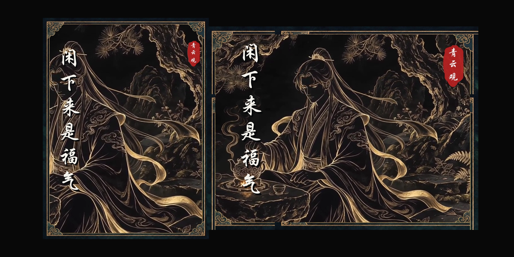

<p align="center">
  
</p>

<h1 align="center">DAO VIDEO</h1>

<p align="center">
  把选题、文案、AI 画面、复刻配音、字幕、BGM、双封面和平台待发布表单连成一条可恢复、可配置的短视频生产线。
</p>

> 当前仓库保持私有。自动发布只负责上传和填写，永远停在最终发布按钮之前。

## 能做什么

- 从主题生成原创中文哲思、传统文化或节气口播文案
- 把确认后的文案拆成分镜，生成静帧和动态视频
- 首次使用时自动把内置“默认音色”上传到用户自己的 MiniMax 账号完成克隆，并导出同次生成的字幕时间戳
- 使用 FFmpeg 合成画面、字幕、品牌包装和手工 BGM 音量包络
- 未指定音乐时自动使用内置 `default-bgm.mp3`；说“替换 BGM”即可改用其他授权音乐
- 从同一视频原帧制作 `3:4` 与 `4:3` 两张封面
- 打包抖音、视频号所需的视频、封面、标题和话题
- 使用 Ego Lite 上传并填写两个平台，最后交回用户确认发布
- 记录每一期的确认状态，随时从现有项目继续生产
- 在发布后 24 小时、72 小时和 7 天记录平台数据，形成单变量调整与效果验证闭环

## 怎么用

安装后直接对你的 Agent 说：

```text
用 dao-video 生成今天的黑金风格视频。
```

或者：

```text
用 dao-video 生成一期水墨风格视频，主题是“真正厉害的人，都懂得守拙”。
```

不用自己检查 Python、FFmpeg、Node.js，不用创建或编辑 `config.yaml`，也不用手动运行诊断命令。Agent 会自动检查环境、创建配置并处理能安全处理的依赖。

首次正式生成前，Agent 会集中确认两件事：用户是提供特定授权音色还是使用默认音色；火山方舟 Seedream 生图与 Seedance 视频生成是否已经开通并确认费用。默认配音样本和默认 BGM 已经内置，不需要用户另外准备。

用户会看到类似提示：

> 1. MiniMax 克隆和配音会产生费用。如果你有特定音色，请提供授权人声或 MiniMax Voice ID；如果没有，请回复“使用默认音色”。
> 2. 本流程会使用付费的 Seedream 生图和 Seedance 视频生成，请确认 ARK_API_KEY、余额和模型权限已准备好。

确认会保存在本地项目状态中，不会每期重复询问；更换音色、模型、服务商或账号时才重新确认。

## 实际效果

下面的素材来自一次完整生产流程，用于展示默认黑金国风预设。演示只包含视觉资产；GIF 已移除复刻配音和 BGM。

### 动态成片预览

<p align="center">
  
</p>

### 四张确认分镜

<p align="center">
  
</p>

### 同一原帧生成横竖封面

<p align="center">
  
</p>

> 演示中的品牌、人物与文案只代表一个项目预设。其他用户应替换为自己的品牌素材、授权音色、BGM 和发布账号。

## 安装

需要 macOS 或 Linux、Python 3、FFmpeg、Node.js、npm 和 npx。剪映草稿与 Ego Lite 发布属于 macOS 可选能力。

```bash
npx skills add captainyufei/dao-video --skill dao-video -g
```

该命令会让安装器选择 Codex、Claude Code、Cursor、OpenCode 等受支持的 Agent，并把唯一的 `dao-video` Skill 安装到相应位置。仓库目前是 Private，执行者需要先登录有访问权限的 GitHub 账号；公开仓库后命令不变。

安装完成后，进入 Skill 所在目录安装 Python 依赖：

```bash
python3 -m pip install -r requirements.txt
```

## 首次使用时会自动处理什么

以下内容供 Agent 执行和故障排查，普通用户不需要逐项操作：

### 先了解费用

这不是完全免费的本地工具。完整流程会调用第三方付费 API：

- **MiniMax**：音色快速复刻和文本转语音按平台规则收费。账户需要先开通 API、创建 Key，并保持可用余额；试听也可能产生语音合成费用。
- **火山方舟**：文案、Seedream 生图和 Seedance 视频生成按模型实际调用计费。视频生成通常是整条流程中成本最高的步骤。
- **Ego Lite**：浏览器本身当前可以免费安装，但抖音、视频号账号、登录验证以及平台规则由用户自己负责。

价格和模型权限可能变化。运行付费生成前，先在对应控制台查看当日价格、余额和模型开通状态；Skill 不会承诺固定单价，也不会在权限失败时擅自切换模型。

### 一、配置 MiniMax 配音

1. 注册并登录 [MiniMax 开放平台](https://platform.minimaxi.com/)，在“接口密钥”中创建 API Key，并按平台提示充值或购买可用额度。
2. 如果尚未配置音色，Agent 会先询问用户是否有特定音色。用户提供授权样本或已有 Voice ID 时使用该音色；用户明确选择“使用默认音色”后，Agent 才上传 `assets/voice/default-voice.mp3`，在该用户自己的账号中克隆为“默认音色”，底层 API Voice ID 为 `dao-default-voice`。
3. 克隆成功后 Agent 自动保存配置，以后直接复用，不会每期重复上传。
4. 用户需要不同声音时，只要说“替换音色”，再提供本人或已明确授权的 10 秒–5 分钟干净人声，或提供自己账号中已有的 Voice ID。Agent 会完成替换和配置更新。
5. 下面命令仅供 Agent 执行和故障排查，普通用户无需运行：

```bash
export MINIMAX_API_KEY="你的 MiniMax API Key"

python3 scripts/minimax_tts.py \
  --ref-audio "/path/to/authorized-voice.wav" \
  --voice-id "my-dao-voice-01" \
  --text "/path/to/test-narration.txt" \
  --output "/path/to/test-narration.wav" \
  --emotion calm \
  --speed 0.9 \
  --subtitle
```

5. 确认测试音频正常后，把同一个 Voice ID 写入本地 `config.yaml`：

```yaml
voice:
  provider: "minimax"
  voice_id: "my-dao-voice-01"
  emotion: "calm"
  speed: 0.9
```

仓库只分发明确作为默认素材提供的“默认音色”参考文件，不分发任何用户后续提供的私人样本、API Key 或账号配置。云端音色仍绑定各自的 MiniMax 账号。根据 MiniMax 当前文档，复刻音色若创建后 7 天内没有正式调用，可能被删除，因此首次克隆后应及时完成一次正式合成。

### 二、配置火山方舟、Seedream 和 Seedance

1. 注册并登录[火山方舟控制台](https://console.volcengine.com/ark/region:ark+cn-beijing/overview)。
2. 完成平台要求的认证、开通计费并确保账户有可用额度。
3. 在[API Key 页面](https://console.volcengine.com/ark/region:ark+cn-beijing/apikey)创建 Key。
4. 确认自己的账号可以调用配置文件中的文案模型、Seedream 生图模型和 Seedance 视频模型。只有 API Key 不代表已经获得全部模型权限。
5. 设置凭证：

```bash
export ARK_API_KEY="你的火山方舟 API Key"
```

本项目使用火山方舟直调 API 和模型 ID，不要求创建 `ep-...` 推理接入点。若某个默认模型对你的账号不可用，在控制台选择已开通的兼容模型，再修改 `config.yaml`；不要在不知情的情况下自动换模型并产生不同费用。

### 三、安装 Ego Lite（需要自动填写发布页面时）

Ego Lite 只在“上传视频、填写标题话题和封面、停在发布前”这一步需要；不使用自动发布准备时可以不安装。

1. 按 [Ego Lite 官方 Quick Start](https://www.egolite.app/document/en/docs/quick-start) 下载 macOS 应用并放入 Applications。
2. 打开 Ego Lite 完成首次设置；如希望沿用浏览器登录状态，可在其引导中选择迁移 Chrome 数据。
3. 应用通常会自动安装 `ego-browser` Skill；也可以单独执行：

```bash
npx skills add citrolabs/ego-lite
```

4. 在 Ego Lite 中分别登录自己的抖音和视频号账号。登录状态与 Space 只保存在本机，不会从本仓库同步。
5. 运行 `python3 scripts/doctor.py --publishing` 验证安装。即使验证通过，最终发布按钮仍必须由用户亲自点击。

### 四、Agent 自动生成本地配置

Agent 会生成一份不会进入 Git 的本地配置；用户无需执行：

```bash
python3 scripts/init_config.py --output config.yaml
```

Agent 会根据当前项目填入能够检测到的内容，并仅询问无法推断的账号或授权信息：

```yaml
project:
  root: "/path/to/video-project"

voice:
  voice_id: "your-minimax-voice-id"

audio:
  bgm_label: "默认 BGM"
  bgm_path: "assets/audio/default-bgm.mp3"
```

再提供服务凭证：

```bash
export ARK_API_KEY="..."
export MINIMAX_API_KEY="..."
export DAO_VIDEO_CONFIG="$PWD/config.yaml"
```

方舟凭证也可以由已经登录的 arkcli 当前 Profile 提供。不要把 API Key、Cookie、浏览器目录、付费账户信息或复刻音色源文件提交到仓库。

## 环境预检（由 Agent 自动执行）

```bash
python3 scripts/doctor.py
```

准备平台发布时，Agent 会自动追加发布检查：

```bash
python3 scripts/doctor.py --publishing
```

预检会检查命令行工具、Python 包、凭证、本地项目、音色、BGM、Ego Lite 和“发布前停止”开关。模型权限与平台登录仍需在首次实际调用时确认。

## 日常工作流

```text
选题与来源
    ↓
原创文案 → 用户确认
    ↓
分镜静帧 → 用户确认
    ↓
配音 → 图生视频 → 字幕与剪辑
    ↓
3:4 / 4:3 封面 → 用户确认
    ↓
发布包 → Ego Lite 上传填写
    ↓
等待用户亲自点击发布
    ↓
24h / 72h / 7d 复盘 → 下期单变量实验 → 验证是否有效
```

## 发布后复盘

复盘不只看播放量，而是从分发、开头留存、正文完播、互动和关注转化逐层诊断。默认将当前作品与同平台、相同观察时长的最近 5 条可比作品中位数比较。

手动录入或从创作者中心读取数据后运行：

```bash
python3 scripts/review_metrics.py \
  --project-root "/path/to/video-project" \
  --episode "20260809-闲下来" \
  --title "闲下来，也是一种福气" \
  --platform douyin \
  --checkpoint-hours 24 \
  --metric views=12000 \
  --metric completion_rate=31.5% \
  --metric avg_watch_seconds=18.2 \
  --metric likes=530 \
  --metric comments=41 \
  --metric shares=86 \
  --metric saves=120 \
  --hypothesis "前五秒进入主题偏慢" \
  --next-change "下一期开头钩子压缩到两秒内，其他设置不变" \
  --target-metric retention_5s
```

数据和报告保存在项目的 `06-复盘/`：

- 保留每个检查点的原始快照，不覆盖历史数据
- 抖音和视频号分开比较
- 区分事实、原因假设和下一步动作
- 每期原则上只调整一个主要变量
- 在下一期相同检查点判断调整为 `effective`、`neutral`、`harmful` 或 `inconclusive`

完整方法见 [`references/review-loop.md`](./references/review-loop.md)。

在 Codex 中可以直接说：

```text
使用 dao-video，以黑金风格生成今天的视频。
```

或者：

```text
使用 dao-video，以水墨风格生成今天的视频。
```

或者从已有项目恢复：

```text
使用 $dao-video 读取项目状态，从上次确认的位置继续，不要重复生成已确认素材。
```

## 核心命令

```bash
# 文案
python3 scripts/ark_llm.py --topic "主题" --out narration.txt

# 黑金国风分镜静帧
python3 scripts/ark_images.py --prompts prompts.txt --outdir assets --scene 围合

# 图生视频
python3 scripts/ark_video.py \
  --images assets/img-01.png,assets/img-02.png \
  --outdir video

# MiniMax 配音与同次字幕时间戳
python3 scripts/minimax_tts.py \
  --text narration.txt \
  --output assets/narration.wav \
  --subtitle
```

模型 ID、音色、情绪、语速、品牌、BGM 和发布 Space 都可以在 `config.yaml` 中调整。完整 Agent 工作规范见 [`SKILL.md`](./SKILL.md)。

## 音频规则

默认不是自动闪避：

- 开头 BGM 较大
- 正文切入后降到恒定音量
- 结尾逐渐升高
- 最后淡出
- 默认删除生成视频的环境音

每一期的语义切点记录在该期 `audio-config.json`，避免只按固定秒数机械处理。

## 发布安全线

- 抖音与视频号在一个长期 Ego Lite Space 的两个标签页中处理
- 两个平台都必须上传正式封面，并以发布主表单缩略图为最终验收依据
- 视频号位置固定为“不显示位置”
- 不自动修改原创声明、可见范围、商业内容、定时发布等不确定开关
- 不点击“发布”“确认发布”“立即发布”“提交发布”或任何等价控件
- 页面准备好后交回用户，由用户完成最终发布

## 可移植性说明

以下内容不会随仓库自动转移：

- MiniMax 复刻音色：音色 ID 通常属于创建它的账号
- 替换用的 BGM 与字体：需要使用者提供有权使用的本地文件；默认 BGM 已内置
- Ego Lite 登录状态和 Space：每台电脑、每个账号需要单独登录
- 火山模型权限：不同账号需要分别开通对应模型
- 剪映草稿目录：仅在兼容的 macOS 剪映专业版环境中可用

## 仓库结构

```text
dao-video/
├── SKILL.md                 # Agent 核心工作规范
├── config.example.yaml      # 可分享的匿名配置模板
├── requirements.txt
├── agents/openai.yaml       # Skill UI 元数据
├── assets/readme/           # 仓库展示素材
├── references/
│   ├── setup.md             # 安装与可移植性
│   ├── workflow.md          # 制作细节与实测约束
│   ├── ego-publish.md       # 发布前自动化与停止线
│   ├── review-loop.md       # 发布后数据复盘与单变量实验
│   └── project-state.example.md
└── scripts/                 # 生成、配音、字幕、剪辑、封面与预检工具
```

本地 `config.yaml`、`references/project-state.md`、密钥、浏览器状态以及用户私有音视频文件均由 `.gitignore` 排除。仓库只包含明确批准分发的默认音色与默认 BGM。

## 当前状态

- 已在青云观实际生产流程中验证文案、黑金分镜、Seedance、MiniMax 复刻音色、字幕、BGM、双封面和 Ego Lite 待发布流程
- 当前默认预设偏向中文传统文化横屏短视频
- 其他品牌可以通过配置复用通用流水线；可直接使用默认音色和默认 BGM，也可提供自己的授权素材与平台账号
