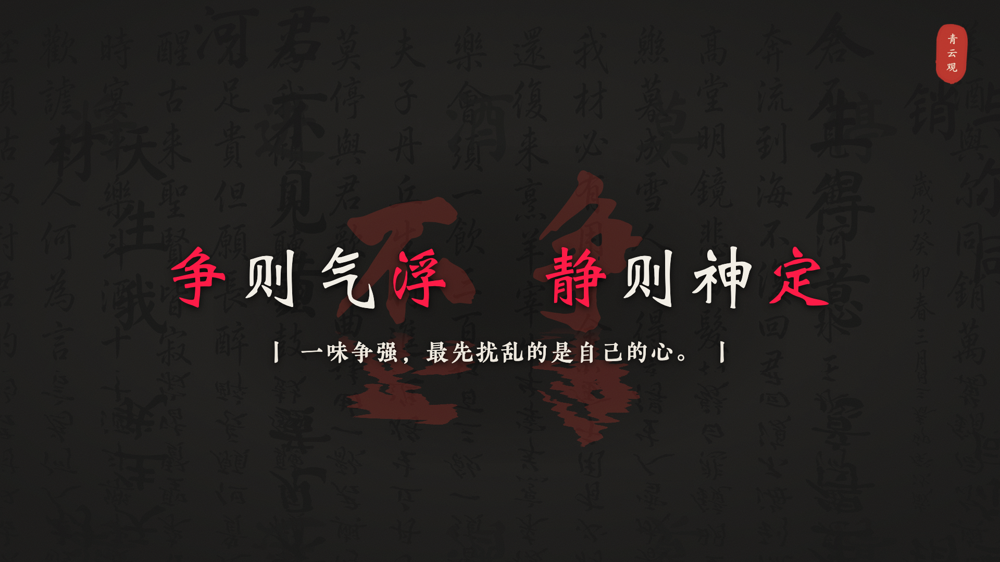
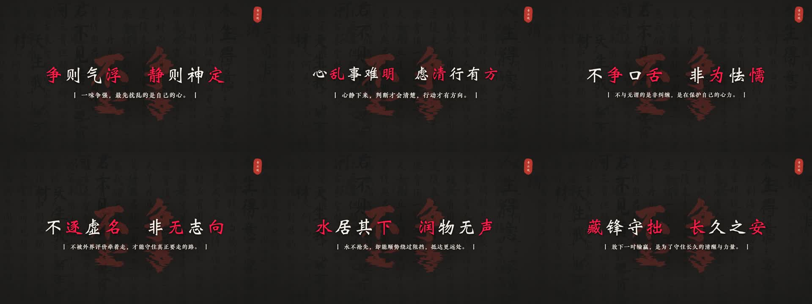
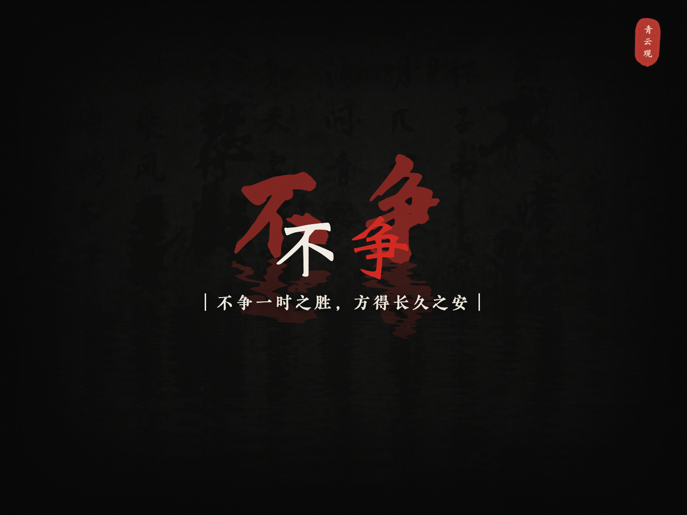
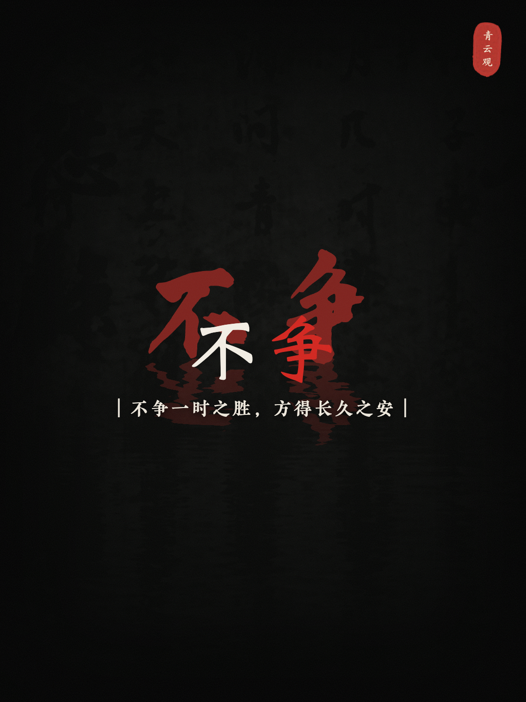

# dao-video

道家短视频生成工作流，包含文案、配音、画面合成、封面和发布准备。

## 水墨效果演示

这是当前确认的 24 秒水墨节奏版本：

<video controls width="100%" src="./20260816-不争/03-成片/不争-水墨24秒节奏版-v10-试听确认.mp4">
  <a href="./20260816-不争/03-成片/不争-水墨24秒节奏版-v10-试听确认.mp4">观看水墨视频演示</a>
</video>

GitHub 如果不直接渲染仓库内的视频，请点击上面的备用链接下载或播放视频。

### 代表画面

### 封面

| 横版 | 竖版 |
| --- | --- |
|  |  |

## 当前水墨基线

- 六屏、12 条主字幕，目标时长 23–26 秒
- 使用已确认的水墨克隆音色，标准参数为 `fluent / 1.08`
- 组间保留自然留白，解释文字只显示、不朗读
- 背景书法完成一次往返运动，时间点根据当次 TTS 时间戳计算

## 目录

- `dist/dao-video-suite-universal/dao-video/`: 通用视频生成 Skill、脚本和参考文档
- `dist/dao-video-suite-universal/dao-ink-video/`: 水墨风格 Skill 和验证规则
- `20260816-不争/04-封面/remotion/`: 本期水墨画面与封面示例源码

## 开源说明

仓库中的账号信息、访问凭据、私有音色标识和本地发布配置不应提交。请从示例配置开始，并在运行前配置自己的服务凭据。
